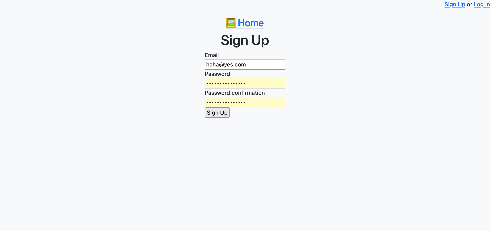
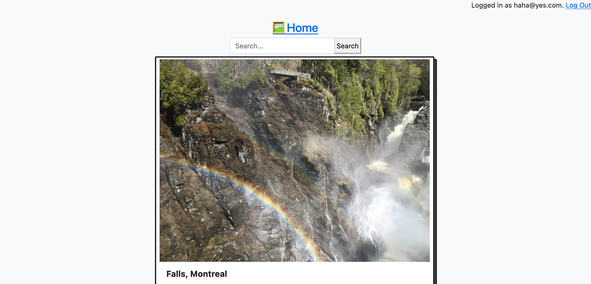
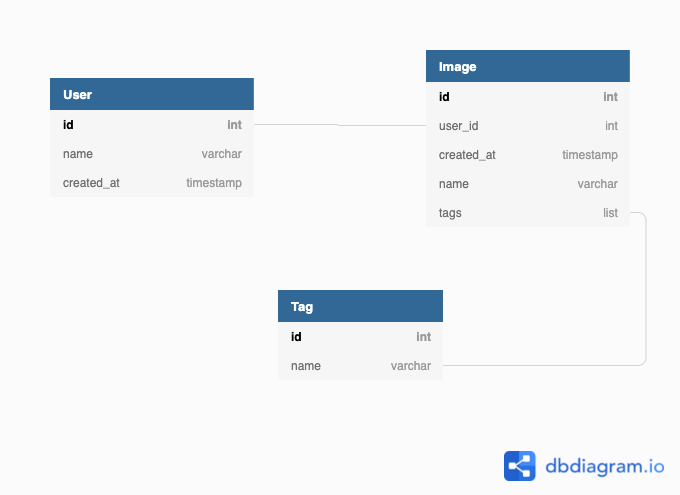
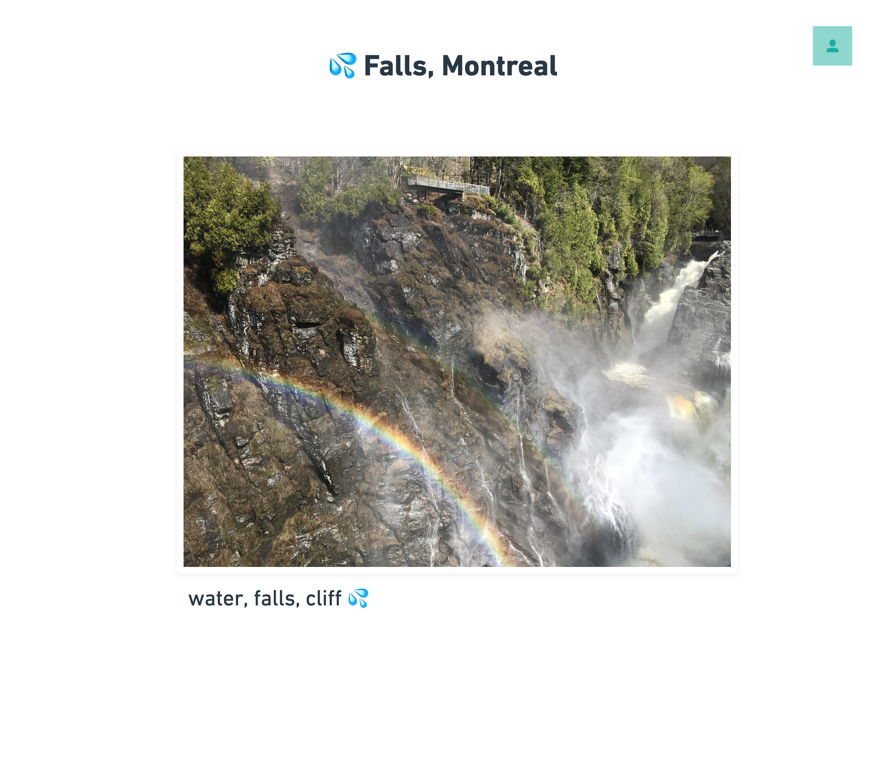

# 📸 Imagine

[Try it now!](https://secret-wildwood-16393.herokuapp.com/)

Imagine is a simple image repository for viewing your images.


## Self-Hosting
To run your own instance of Imagine, define the following variables in `/config/application.yml`:
```
AWS_BUCKET_NAME=
AWS_ACCESS_KEY_ID=
AWS_SECRET_ACCESS_KEY=
AWS_REGION=
```


## Roadmap

- [x] feat: bcrypt password hashing
- [x] feat: create seeds.rb for database
- [x] feat: integrate with S3 for file storage
- [ ] fix: [search bug](http://billpatrianakos.me/blog/2013/09/29/rails-tricky-error-no-implicit-conversion-from-symbol-to-integer/)
- [ ] feat: google cloud vision API to automatically tag images


## Examples
The app was built with Ruby on Rails with ruby-bcrypt for user authentication, AWS S3 for file storage, and Bootstrap + Blocks.CSS for styling.





## Database
Entity mapping with dbdiagram:


## UI
Wireframe with Whimsical:

